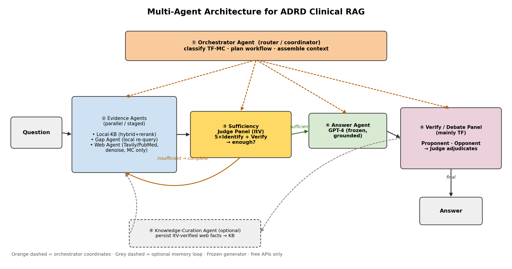

# Multi-Agent Architecture for ADRD Clinical RAG

A role-specialized, orchestrated multi-agent design that re-expresses the current pipeline as
collaborating agents and adds one genuinely new capability (a verify/debate panel for the
hard binary-judgment questions). Constraints preserved: **frozen generator, free APIs, no
fine-tuning.**

## Agents & roles

| # | Agent | Role | Backed by |
|---|---|---|---|
| ① | **Orchestrator** (controller) | Classifies the question (TF/MC), plans the workflow, decides when to trigger completion and which evidence agents to call, assembles the working context, routes to verification. The "conductor." | `run_retrieval_adrd.py` control flow + a thin planner prompt |
| ② | **Evidence Agents** (specialists, parallel/staged) | • **Local-KB Agent** — hybrid BM25+dense retrieval + rerank. • **Gap Agent** — on insufficiency, decompose the gap into targeted queries, re-search the LOCAL KB. • **Web Agent** — Tavily/PubMed external retrieval + denoising (MC only). | `advanced_retriever.py`, `llm_utils.generate_gap_query`, `web_fallback_retriever.py` |
| ③ | **Sufficiency Judge Panel** (ItV) | A panel: 5 Identify-agents each name the missing fact independently → semantic consensus → a Verify-agent checks attribution → collective verdict *enough / not-enough* + the gap. Drives the orchestrator's route. | `gate.py` (ItV) |
| ④ | **Answer Agent** | Frozen GPT-4, strict grounding; produces the answer from the curated context only. | `generate_answers_gpt4_ADRD_Bench.py` |
| ⑤ | **Verify / Debate Panel** (NEW) | Mainly for TF binary judgments: a **Proponent** argues the statement is supported, an **Opponent** argues against, a **Judge** adjudicates from the context. Catches absolute/definitional nuance a single pass misses. | new (prompt-orchestrated around the frozen generator) |
| ⑥ | **Knowledge-Curation Agent** (optional) | Persist ItV-verified external facts back into the KB so the system grows over time. | new (writes to Chroma + BM25) |

## Coordination flow

1. **Orchestrator** receives the question → classifies type → dispatches the **Local-KB Agent**.
2. **Judge Panel (ItV)** evaluates the retrieved context:
   - **sufficient** → **Answer Agent** generates.
   - **insufficient** → **Gap Agent** re-queries the local KB (free) → re-judge; if still short **and** MC → **Web Agent** (denoised) → merge → re-judge → Answer Agent.
3. **Verify/Debate Panel** checks the answer (Proponent vs Opponent → Judge), mainly for TF → final answer.
4. (async) **Curation Agent** stores newly-verified external facts back into the KB.

**Communication**: a shared *blackboard* (the working context object) that agents read/write —
retrieved passages, the identified gap, sufficiency verdict, candidate answer, debate transcript.

## What is genuinely new vs re-expressed

- **Re-expressed** (same behavior, agent framing): Evidence Agents, Judge Panel, Answer Agent.
  The Judge Panel and the Identify-agents are already a real multi-call ensemble in `gate.py`.
- **Genuinely new capability**: the **Verify/Debate Panel** — the one place expected to raise
  accuracy, aimed at the remaining weak spot (TF binary-judgment nuance: absolute/definitional
  statements). It is prompt-orchestration around the frozen generator (no fine-tuning).
- **Optional new**: the **Curation Agent** (self-growing KB).

## Honest scope

- Multi-agent will **not** fix "knowledge unavailable anywhere" errors (a few TF/MC items).
- For short factoid TF/MC, more agents = more places to fail + higher latency/cost — add only
  where a role earns its keep. The debate panel must be **A/B-tested** (it can also break
  correct answers), not assumed to help.
- Net-new accuracy lever = ⑤ Debate Panel; everything else is cleaner structure + parallelism.
